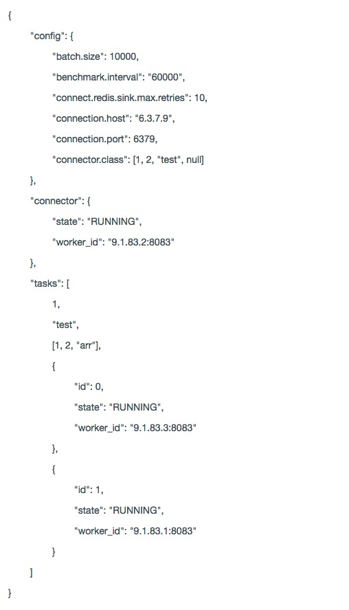

## 格式化输出json对象

### 输出形式
```
[ { text: '{', indent: 0 },
  { text: '"config": {', indent: 4 },
  { text: '"batch.size": 10000,', indent: 8 },
  { text: '"benchmark.interval": "60000",', indent: 8 },
  { text: '"connect.redis.sink.max.retries": 10,', indent: 8 },
  { text: '"connection.host": "6.3.7.9",', indent: 8 },
  { text: '"connection.port": 6379,', indent: 8 },
  { text: '"connector.class": [1, 2, "test", null]', indent: 8 },
  { text: '},', indent: 4 },
  { text: '"connector": {', indent: 4 },
  { text: '"state": "RUNNING",', indent: 8 },
  { text: '"worker_id": "9.1.83.2:8083"', indent: 8 },
  { text: '},', indent: 4 },
  { text: '"tasks": [', indent: 4 },
  { text: '1,', indent: 8 },
  { text: '"test",', indent: 8 },
  { text: '[1, 2, "arr"],', indent: 8 },
  { text: '{', indent: 8 },
  { text: '"id": 0,', indent: 12 },
  { text: '"state": "RUNNING",', indent: 12 },
  { text: '"worker_id": "9.1.83.3:8083"', indent: 12 },
  { text: '},', indent: 8 },
  { text: '{', indent: 8 },
  { text: '"id": 1,', indent: 12 },
  { text: '"state": "RUNNING",', indent: 12 },
  { text: '"worker_id": "9.1.83.1:8083"', indent: 12 },
  { text: '}', indent: 8 },
  { text: ']', indent: 4 },
  { text: '}', indent: 0 } ]
```

### 使用
参见demo.js
```
let parseJson = require('./index.js')
let output = parseJson(someJsonData)
```

以在vue中使用为例:
```
p(v-for="value of dataCollection", :style="{paddingLeft: value.indent * 8 +'px'}") {{value.text}}
```


### 注意
需要ES6的支持